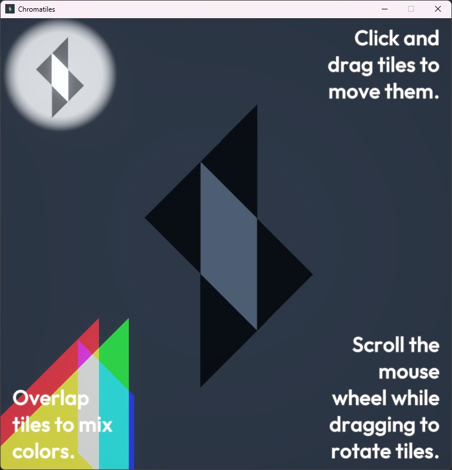
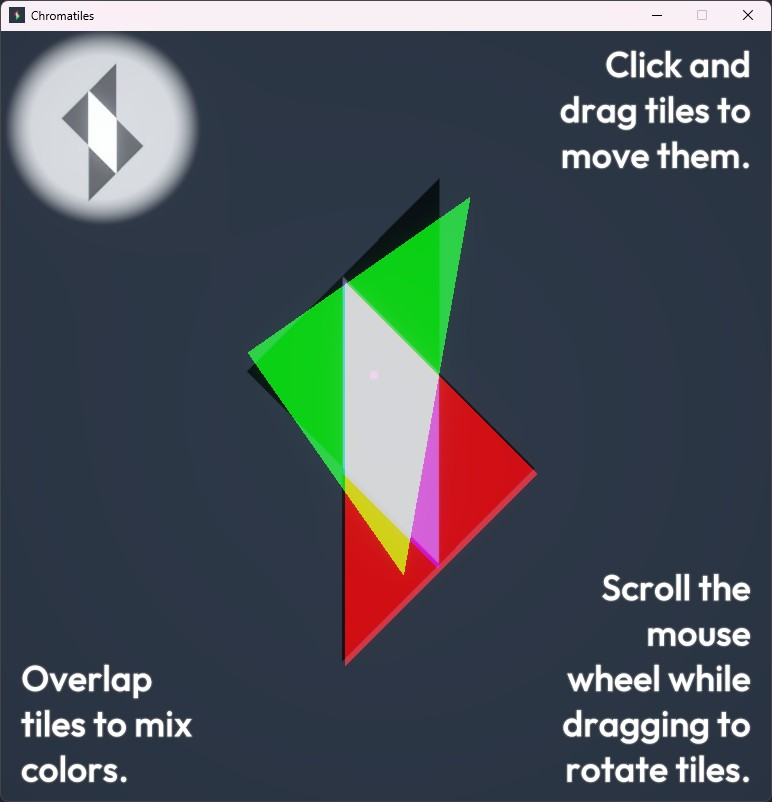
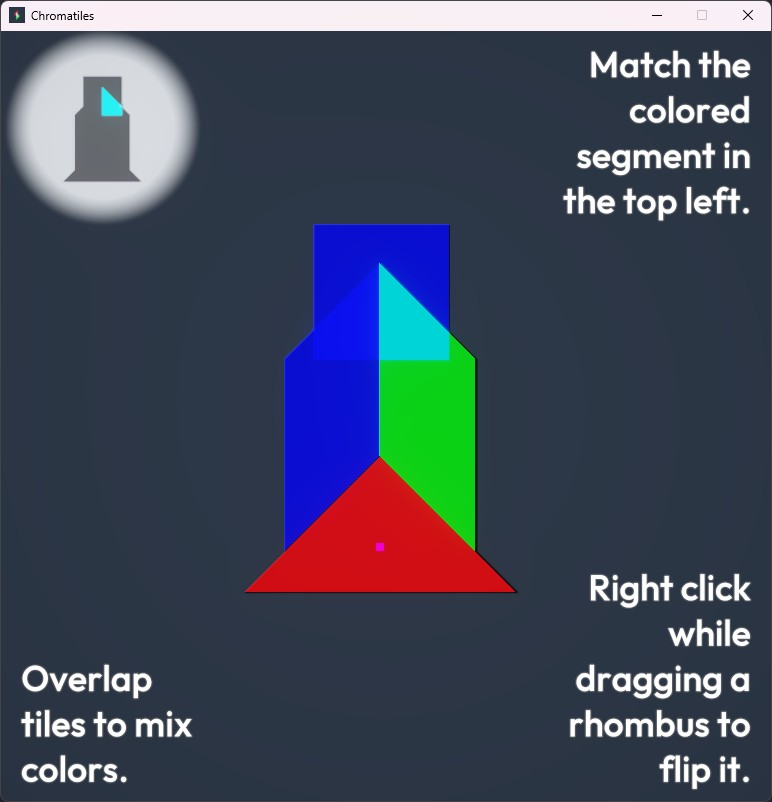
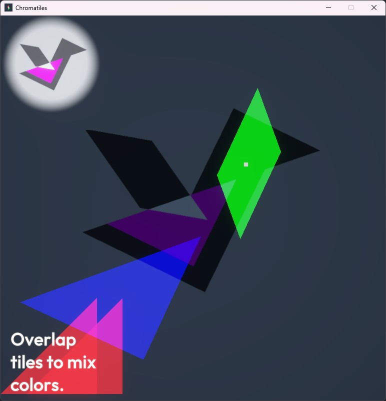

# 🎨 Chromatiles

**A colourful spin on a classic puzzle.**

Chromatiles is a puzzle game which re-imagines the classic tangram challenge. Players arrange coloured tiles to fit within an outline, but unlike the traditional style, the pieces are translucent and can overlap. Overlapping shapes blend their colours, creating new shades that must match the target regions inside the outline. This mechanic transforms a simple shape-fitting exercise into a visually stimulating and mentally engaging puzzle experience. 

## 📄 Documentation

- [Game Design Document](https://d2l.deakin.edu.au/d2l/home/1544115) - Complete design specification
- [Worksheet 1](https://d2l.deakin.edu.au/d2l/home/1544115) - Game Theory And Strategy Worksheet & Checklist
- [Worksheet 2](https://d2l.deakin.edu.au/d2l/home/1544115) - Feedback and Balance Worksheet & Checklist
- [AGILE Documentation](https://d2l.deakin.edu.au/d2l/lms/discussions/messageLists/frame.d2l?ou=1544115&tId=973841&fId=0&threadId=0&postId=0&groupFilterOption=0) - Weekly submissions showing progress over the weeks
- [Chromatiles](https://d2l.deakin.edu.au/d2l/home/1544115) - Executable game build
- [Unity Project](https://d2l.deakin.edu.au/d2l/home/1544115) - Chromatiles project (only Assets and ProjectSettings files uploaded to CloudDeakin due to filesize limits)
- [Video Demo](panopto TBD) - Video showing gameplay and solutions to each puzzle

## 📞 Prototype Team

- s223387609 (Daniel Soutar)
- LordofSpirals (Darren Copley)
- sekibayashi00 (Diing Jok)
- (Mati Ur Rehman)

## 🖼️ Game Screenshots
*This is only some of the levels! Play the game to see everything there is to offer :)*

  
## 🎮 Game Overview

### Core Innovation
- **Traditional Tangram Base**: Classic 7-piece tangram puzzles as foundation
- **Color Mixing Mechanics**: Translucent tiles overlap using additive color mixing (like colored lights)
- **Dual Challenge System**: Match both the target outline AND the target colors
- **Progressive Complexity**: From simple shapes to complex multi-color patterns

### Key Features
- **25+ Handcrafted Levels**: Carefully designed progressive difficulty curve
- **Daily Puzzle Mode**: New challenge every day (Wordle-style engagement)
- **Flexible Tile System**: Not limited to traditional 7-piece sets
- **Multiple Difficulty Layers**: Extra tiles, color complexity, time challenges

## 🚀 Prototype Timeline

### Foundation (Weeks 1) 
- [x] Game design document completed
- [x] Select game engine (Unity/Godot evaluation)
- [x] Set up development environment

### Core Prototype 1/2 (Week 2)
- [x] Implement tangram tile system
- [x] Shape drag and rotate system

### Core Prototype 2/2 (Week 3)
- [x] Build color blending mechanics
- [x] Create outline detection system
- [x] Design initial 5 levels

### Enhancement and Polish (Week 4-5)
- [x] Basic tutorial instructions / introduction
- [x] Level progression
- [x] Audio integration (SFX)
- [x] UI/UX implementation
- [x] Bugfixes and internal playtesting
- [x] External playtesting 
- [x] Further polish and optimization

## 🛠️ Technical Specifications

### Platforms
- **Prototype**: PC
- **Future**:
-   *Main platforms*: iOS and Android.
-   *Future ports*: PC and console, though they would need different control schemes. 

### Core Systems
- **Puzzle Engine**: Shape detection and validation
- **Color Mixer**: Additive RGB color blending
- **Level Manager**: Progression system
- **Audio Manager**: Dynamic SFX

### Development Tools
- **Game Engine**: Unity v6000.0.40f1
- **Level Editor**: In-engine tools
- **Version Control**: Git + GitHub
- **Playtesting**: Both internal and external (managed by lead playtester - Daniel Soutar)

## 🎨 Art & Design Philosophy

### Visual Style
- **Inspiration**: Mini Metro's bold, flat color design
- **Color Palette**: Primary (RGB) + Secondary (CMY) colors
- **UI Design**: Clean, minimalist, touch-friendly
- **Feedback**: Clear visual/audio success indicators

### Psychological Design
- **Operant Conditioning**: Rewarding puzzle completion
- **Flow Theory**: Balanced challenge progression  
- **Bartle Types**: Appeals to Achievers and Explorers
- **Daily Engagement**: Wordle-inspired return mechanics

## 📱 Monetization Strategy (extending beyond Prototype)

- **Free-to-Play**: Easy entry for viral growth
- **Ad-Supported**: Interstitial and reward videos
- **IAP Options**: Extra attempts, cosmetic themes, level packs
- **No Pay-to-Win**: All levels solvable without payment

## 📊 Market Research

### Genre Performance
- **Casual Games**: Largest gaming genre globally
- **Target Demo**: 70% female audience for puzzle games
- **Success Examples**: Merge Mansion (60M+ downloads, $600M+ revenue)
- **Daily Puzzles**: Proven engagement model (Wordle, NYT Games)

### Competitive Analysis
- **Traditional Tangrams**: Limited color mechanics
- **Color Puzzles**: Lack tangram's spatial challenge
- **Opportunity**: First to combine both mechanics effectively

## 🎯 Target Audience

| Audience | Demographics | Platform | Motivation |
|----------|--------------|----------|------------|
| **Primary** | Female 45-55+ (70/30 split) | Mobile/Tablet at home | Brain training, casual entertainment |
| **Secondary** | 25-35 commuters (60/40 split) | Mobile during commute | Quick daily routine, achievement |
| **Tertiary** | 20-30 social players (50/50 split) | Mobile/social sharing | Trending games, social media sharing |

## 🖼️ Game Moodboard / Concept Art
*Concept: Traditional tangram meets additive color mixing*

